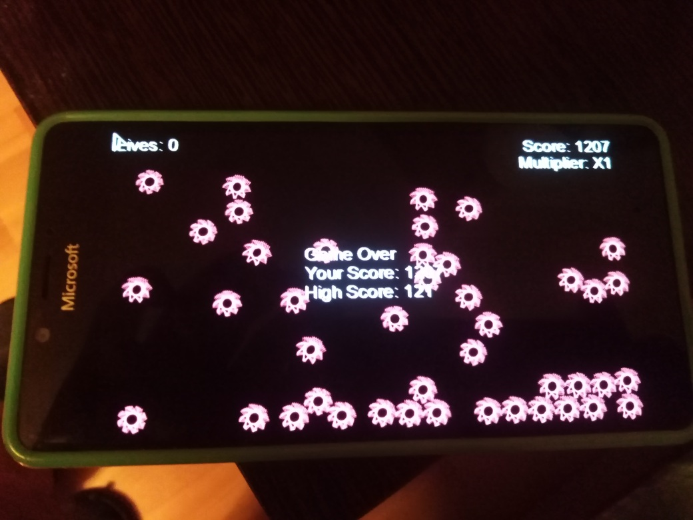

# GeoWar v1.0.4 (alpha)

## About
This is my *veeery quuuick* W10M port of [Nixxs's GeoWar](https://github.com/Nixxs/GeoWar) project. :)

Main goal: do some testing/exploration of new "native" (not mine) MonoGame.Framework.WindowsUniversal v3.7.1.189 package 

## Screenshot(s) 

## Status of my GeoWar porting
- Main W10M device : Lumia 950; sdk 15063+ (Last) - all ok and touchscreen reacted .. but no screen rescaling :( 
- Secondary W10M device : sdk 10240 (Astoria) - touchscreen fixed (my own tweaked MonoGame UWP Framework used)
- Game sounds&music - fixed (some support of cool fx effects discovered)
- Game speed -- fixed too :)
- Original kbd control still present for desktop mode 
- Fullscreen mode distorted on Astoria ("header"/"footer" not hide -- game score truncated :)
- "Screen autoscaling" added (to/for supporting different devices / screen sizes)
- Content (resources) optimized (reduced from 53 mb to 22mb)

## How to create this UWP XNA game? 

### Video tutorial(s)
Follow the Something Random youtube channel for development updates: 

https://www.youtube.com/channel/UCdbQJRNyC7JdgvsxZLNhCzw

### GameDev: How-to (text)
https://gamedevelopment.tutsplus.com/tutorials/make-a-neon-vector-shooter-in-xna-basic-gameplay--gamedev-9859

## Reference
- https://github.com/Nixxs/GeoWar Nixxs's GeoWar
- https://github.com/Nixxs/ Something Random (the author/developer/creator of GeoWar uwp desktop/xbox game, learning videos, etc.) 

## .
As is. Learn purposes only

## ..
[m][e] Feb 2024
