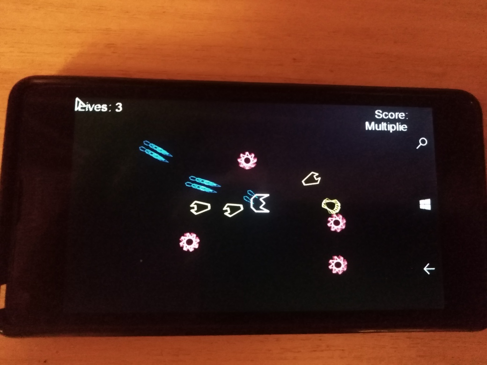

# GeoWar
My veery quick W10M port of [Nixxs's GeoWar](https://github.com/Nixxs/GeoWar) project.

## Screenshot(s) (Target: win 11 on desktop pc, not W10M yet)

## About
https://gamedevelopment.tutsplus.com/tutorials/make-a-neon-vector-shooter-in-xna-basic-gameplay--gamedev-9859

## How to create this UWP XNA game?
Follow the Something Random youtube channel for development updates: 

https://www.youtube.com/channel/UCdbQJRNyC7JdgvsxZLNhCzw

## Status of W10M port
- UWP base (sdk 10240) - ready
- Music (song) play - broken
- Game speed -- crazy =(
- No touch sense yet, only original kbd control at now

## .
As is. Learn purposes only

## ..
[m][e] 2023
