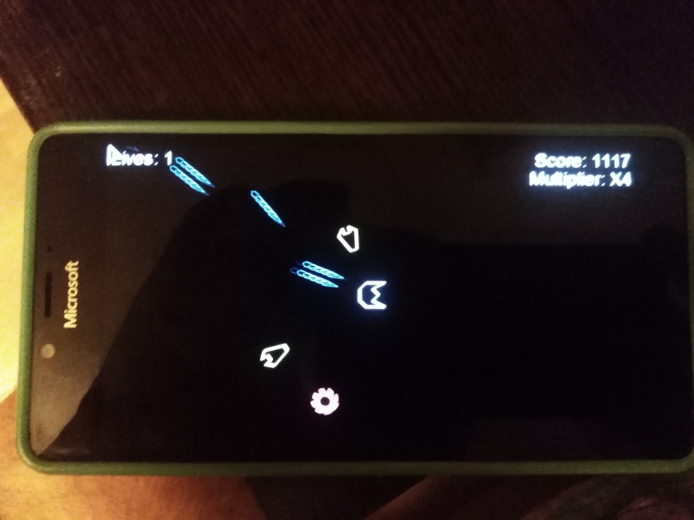

# GeoWar

## About
This is my *veeery quuuick* W10M port of [Nixxs's GeoWar](https://github.com/Nixxs/GeoWar) project. :)

Main goal: do some testing/exploration of new "native" (not mine) MonoGame.Framework.WindowsUniversal v3.7.1.189 package 

## Screenshot(s) 

## How to create this UWP XNA game?
Follow the Something Random youtube channel for development updates: 

https://www.youtube.com/channel/UCdbQJRNyC7JdgvsxZLNhCzw

## Status of my GeoWar porting
- Main W10M device : Lumia 950; sdk 15063+ (Last) - all ok and touchscreen reacted .. but no screen rescaling :( 
- Secondary W10M device : sdk 10240 (Astoria) ready but touchscreen not reacted (very strange... possible reason: not tweaked MonoGame.Framework.WindowsUniversal package!)
- Game sounds - fixed
- Game speed -- fixed too :)
- Original kbd control still presend for desktop mode 
- Fullscreen mode not distorted "header"/"footer" -- so interesting :)

## GameDev: How-to
https://gamedevelopment.tutsplus.com/tutorials/make-a-neon-vector-shooter-in-xna-basic-gameplay--gamedev-9859

## ToDo
- Explore Assets folder
- See Content: maybe, double resources (soundes, images end fx effects!)

## .
As is. Learn purposes only

## ..
[m][e] Feb 2024
